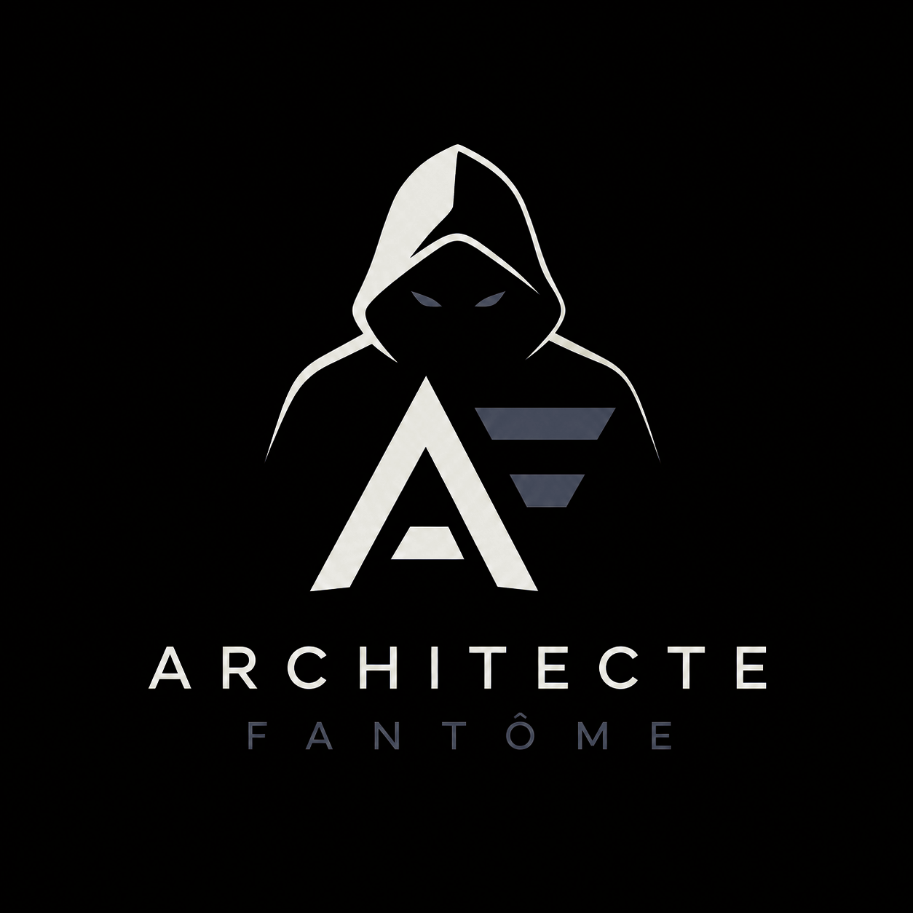

<div align="center">



<br>

> _Construire. Casser. Réparer. Concevoir. Exploiter. Arbitrer. Diriger._

</div>

# ARCHITECTE-FANTOME

> **Construire. Casser. Réparer. Concevoir. Exploiter. Arbitrer. Diriger.**

ARCHITECTE-FANTOME est un parcours CrazyDevs d'ingénierie logicielle conçu pour transformer
progressivement un apprenant qui sait coder en quelqu'un capable de comprendre, construire,
mesurer, sécuriser, exploiter et défendre des systèmes.

La direction professionnelle visée est :

```text
Staff Engineer / Principal Engineer
            +
Software Architecture / Solutions Architecture
            +
fondations fortes en Software Engineering,
Backend, Cloud et AI Integration
```

Ce n'est pas une promesse de titre.

Le parcours entraîne les compétences et les preuves qui rendent cette trajectoire crédible.
L'expérience professionnelle, le scope réel, l'impact organisationnel et les conséquences vécues
restent des dimensions du monde du travail.

## Démarrage zéro friction

Tu peux commencer sans compte cloud, sans API et sans installer dix outils. Le minimum est **Node 22.23.2 + un éditeur de texte**. Git et VSCode sont utiles ensuite, pas comme barrière d'entrée.

Avant la première séance, lance le diagnostic :

```bash
Ouvre le `SETUP.md` de l’activité : il contient le contrôle de présence adapté.
```

Tu es offline ? Le même parcours fonctionne avec `SETUP.md`, puis le `SETUP.md` local de chaque activité, fournissent le contrat de secours offline et la procédure adaptée à la technologie.

## Avant de commencer

Tu n'as pas besoin de comprendre les 1 600+ fichiers du dépôt.

Commence ici :

**[00-GUIDE](06-ANNEXES-TRANSVERSES/00-GUIDE.md)**

Il répond aux questions les plus importantes avant le parcours :

```text
Je pars de zéro.
        |
        v
Qu'est-ce que le métier ?
        |
        v
Qu'est-ce que je dois apprendre ?
        |
        v
Dans quel ordre ?
        |
        v
Quel marché ?
        |
        v
Quelle trajectoire ?
        |
        v
Pourquoi Staff / Principal / Architecture ?
```

Puis :

**[01 - COMMENT UTILISER LE PARCOURS](06-ANNEXES-TRANSVERSES/01-COMMENT-UTILISER-LE-PARCOURS.md)**

Il explique comment naviguer dans le dépôt sans transformer l'arborescence en checklist géante.

Ensuite seulement :

**[START HERE](00-SOCLE/01-GETTING-STARTED/01-START_HERE.md)**

## Comment lire le parcours

Le dépôt possède un fil canonique.

```text
00-GUIDE
    |
    v
01-COMMENT-UTILISER-LE-PARCOURS
    |
    v
START HERE
    |
    v
00 SOCLE
    |
    v
01 CADRAGE
    |
    v
02 CONSTRUCTION
    |
    v
03 PILOTAGE
    |
    v
04 EPREUVE
    |
    v
05 MAITRISE
```

Les numéros donnent une direction, pas une permission de consommer tout le dépôt.

Les dossiers `95-*`, `96-*`, `97-*`, `99-*` servent principalement à augmenter la profondeur
de pratique, de vérification et de transfert autour d'un module.

Les annexes transverses ont leurs propres noms canoniques.

**Règle importante : ne lis pas le dépôt comme un livre.**

Lis le chemin qui t'est demandé, puis ouvre une annexe quand une étape t'y envoie.

## Règle CrazyDevs

Chaque concept important doit laisser une trace mémorable :

```text
mission
piège
personnage
analogie
incident
conflit
conséquence
```

Les univers autorisés servent à ancrer un mécanisme.

Ils ne remplacent jamais l'explication technique.

> Une bonne blague aide à retenir une idée.
>
> Elle ne devient jamais la preuve que tu l'as comprise.

## Pour qui ?

Pour quelqu'un qui veut aller au-delà de :

```text
"j'arrive à faire marcher mon code"
```

vers :

```text
"je comprends pourquoi il marche,
je sais pourquoi il casse,
je sais quoi mesurer,
je sais quoi sécuriser,
je sais combien cela coûte,
et je peux défendre ma décision."
```

Tu peux commencer débutant.

Tu peux aussi entrer avec des bases déjà acquises.

Le parcours adapte la profondeur via les niveaux et les preuves, pas via une collection infinie de technologies.

## Le cerveau 2035+

Le noyau durable d'ARCHITECTE-FANTOME n'est pas un framework particulier.

Il repose sur :

```text
fondamentaux
    +
software engineering
    +
systems thinking
    +
architecture
    +
cloud
    +
reliability
    +
security
    +
cost / product judgment
    +
AI-assisted engineering
    +
technical leadership
```

L'IA est traitée comme un nouvel outil de travail et d'automatisation, pas comme une nouvelle
identité professionnelle.

Le but est d'apprendre à :

```text
comprendre
    ->
construire
    ->
observer
    ->
vérifier
    ->
décider
    ->
réviser
    ->
transférer
```

même lorsque les outils changent.

## La boucle du parcours

ARCHITECTE-FANTOME suit une boucle unique :

**Comprendre -> Construire -> Casser -> Réparer -> Concevoir -> Exploiter -> Arbitrer -> Diriger**

Mais cette boucle ne reste pas dans le livre.

Pour les exercices importants, elle est prolongée par :

```text
EXERCICE
    |
    v
CONTEXTE
    |
    v
CONTRAINTE
    |
    v
HYPOTHESE
    |
    v
IMPLEMENTATION
    |
    v
OBSERVATION
    |
    v
PERTURBATION
    |
    v
MESURE
    |
    v
DECISION / REVISION
    |
    v
POSTMORTEM
    |
    v
TRANSFER
    |
    v
REVIEW
    |
    v
SORTIE TERRAIN
```

Tous les exercices n'ont pas la même profondeur.

Un exercice de fondamentaux reste petit.

Un mini-projet devient une simulation structurée.

Un Boss ou un Capstone introduit davantage d'incertitude, de décision et de défense.

Puis les preuves de haut niveau peuvent sortir du dépôt.

## Pratique terrain

Le standard commun est documenté dans :

**[FIELD-ORIENTED PRACTICE](00-SOCLE/00-FIELD-ORIENTED-PRACTICE.md)**

Le parcours distingue volontairement :

```text
T0 = simulation
T1 = projet vivant
T2 = utilisateurs externes
T3 = open source / mission / client
T4 = production suivie
```

Une simulation réaliste est une bonne préparation.

Elle n'est pas présentée comme une expérience professionnelle.

Cette distinction est volontaire et non négociable.

## Les mini-projets

Les mini-projets sont le principal pont entre apprentissage et ingénierie appliquée.

Ils réexposent les mécanismes sous plusieurs contextes :

```text
async
cache
API
legacy
memory
distributed systems
security
cost
spec drift
AI supervision
architecture decisions
```

Le standard est documenté dans :

**[MINI-PROJECT FIELD PRACTICE STANDARD](02-CONSTRUCTION/02-MINI-PROJECTS/00-FIELD-PRACTICE-STANDARD.md)**

et la répétition est cartographiée dans :

**[REEXPOSURE MAP](02-CONSTRUCTION/02-MINI-PROJECTS/01-REEXPOSURE-MAP.md)**

L'objectif n'est pas de refaire la même fiche.

L'objectif est de vérifier qu'un mécanisme reste utilisable lorsque le contexte change.

## Les épreuves

Un challenge vérifie une capacité.

Un Boss demande une production plus complète.

Un Capstone rassemble plusieurs dimensions.

Les preuves de haut niveau disposent désormais d'une voie d'évaluation externe :

**[EXTERNAL VALIDATION](04-EPREUVE/08-EXTERNAL-VALIDATION/README.md)**

et d'une fiche de sortie :

**[FIELD EXIT CARD](04-EPREUVE/00-FIELD-EXIT-CARD.md)**

Cette sortie permet de distinguer :

```text
ce qui est simulé
ce qui est observé
ce qui est externe
ce qui est réellement vécu
```

## Evidence, pas seulement activité

Lire n'est pas maîtriser.

ARCHITECTE-FANTOME utilise donc plusieurs formes de preuve :

```text
production
explication
debugging
mesure
décision
défense
révision
transfert
```

Le but n'est pas de remplir des fichiers.

Le but est de pouvoir montrer une transformation :

```text
PROBLEME
   |
   v
CONTRAINTES
   |
   v
OPTIONS
   |
   v
DECISION
   |
   v
CONSEQUENCES
   |
   v
REVISION
```

## Repère cognitif

Lire une leçon ne signifie pas maîtriser son contenu.

AF distingue plusieurs actions :

| Action | Dans AF |
|---|---|
| Mémoriser | rappeler une notion |
| Comprendre | l'expliquer avec ses propres mots |
| Appliquer | l'utiliser dans une situation |
| Analyser | identifier structure, causes, dépendances |
| Évaluer | juger avec critères, preuves et compromis |
| Créer | concevoir ou reconstruire une solution |

Le transfert ajoute une question différente :

> Est-ce que le même principe reste valable lorsque le contexte change ?

Le parcours utilise aussi ses propres échelles de profondeur :

- **[Échelle cognitive adaptative](06-ANNEXES-TRANSVERSES/32-ECHELLE-COGNITIVE-ADAPTATIVE.md)**
- **[Anti-Recette Engine](06-ANNEXES-TRANSVERSES/33-ANTI-RECETTE-ENGINE.md)**

Ces mécanismes évitent qu'une personne progresse simplement parce qu'elle reconnaît la forme d'un exercice.

## Les niveaux

| Niveau | Transformation |
|---|---|
| **00 : Socle** | Comprendre le code et résoudre un problème sans se perdre. |
| **01 : Cadrage** | Choisir le bon problème, traiter l'asynchrone et diagnostiquer proprement. |
| **02 : Construction** | Construire, tester, profiler, refactorer, poser des frontières solides et comprendre le client comme un système. |
| **02bis : Architecture** | Sous-étape de Construction pour comparer des options et prendre des décisions d'architecture. |
| **03 : Pilotage** | Faire fonctionner le système : sécurité, observabilité, fiabilité, cloud, plateforme, produit, coût et équipe. |
| **04 : Épreuve** | Lire une grosse codebase, gérer le temps réel et défendre un système complet. |
| **05 : Maîtrise** | Combiner, arbitrer, transmettre et transférer sous contrainte. |

## Les trois profondeurs

Le corpus complet ne constitue pas une checklist.

Il possède trois profondeurs :

```text
CORE
route intensive
16 semaines
12 h / semaine

DEPTH
approfondissement quand une faiblesse apparaît

VAULT
référence durable, variantes et ressources
```

Le détail du CORE est dans :

**[19A - ROUTE CORE 16 SEMAINES](06-ANNEXES-TRANSVERSES/19A-ROUTE-CORE-16-SEMAINES.md)**

La cartographie des mini-projets est dans :

**[25 - CORE MINI PROJECT MAP](06-ANNEXES-TRANSVERSES/25-CORE-MINI-PROJECT-MAP.md)**

Cette séparation évite de confondre :

```text
richesse du corpus
      !=
quantité à consommer
```

## Où commencer ?

```text
1. Lire 00-GUIDE si tu pars de zéro ou si tu veux comprendre la trajectoire.
2. Lire 01-COMMENT-UTILISER-LE-PARCOURS.
3. Ouvrir START HERE.
4. Suivre le fil canonique.
5. Produire la preuve demandée.
6. Revenir sur une faiblesse plutôt que sauter à dix technologies.
```

Ton tableau de bord personnel :

**[PROGRESSION.md](PROGRESSION.md)**

Les compteurs :

**[COMPTEURS DU PARCOURS](06-ANNEXES-TRANSVERSES/18-COMPTEURS-DU-PARCOURS.md)**

Le Staff Gate :

**[STAFF READINESS GATE](06-ANNEXES-TRANSVERSES/37-STAFF-READINESS-GATE.md)**

## Ce que produit l'apprenant

Pas 500 pages de notes.

Quelques preuves solides et réutilisables :

```text
ADR
API / contracts
tests
performance
memory analysis
security
observability
SLI / SLO
recovery
cloud choice
budget
product / cost / risk trade-offs
project fil rouge
capstone
postmortem
external review
terrain evidence
```

Chaque preuve forte doit raconter une histoire :

```text
problème
   ->
contraintes
   ->
options
   ->
décision
   ->
résultat
   ->
surprise
   ->
révision
```

## Quand peut-on dire "terminé" ?

Pas quand le dernier dossier est coché.

Terminé signifie plutôt :

```text
je peux prendre un problème ambigu
        ->
construire une solution raisonnable
        ->
identifier ses limites
        ->
mesurer ce qui compte
        ->
réagir à une panne
        ->
expliquer le coût
        ->
défendre mes choix
        ->
accepter une objection valide
        ->
réviser ma décision
        ->
transférer le principe ailleurs
```

Le dernier niveau ne donne pas 300 notions de plus.

Il te demande de combiner intelligemment celles que tu as déjà rencontrées.

> **Diplôme AF != Staff Engineer reconnu.**
>
> Le parcours prouve une préparation intensive et des productions évaluables.
> Le scope, l'influence et les conséquences vécues dans le monde professionnel
> restent de l'expérience professionnelle.

## Le vrai principe CrazyDevs

Tu verras parfois une architecture tordue volontairement.

Tu verras des bugs.

Tu verras des contraintes qui ne rentrent pas bien ensemble.

Tu verras des décisions qui deviennent mauvaises lorsque le contexte change.

C'est volontaire.

> Voilà le problème.
>
> Voilà ce qu'on pense pouvoir faire.
>
> Voilà ce qui casse.
>
> Maintenant explique pourquoi.
>
> Puis fais mieux.

Le but n'est pas de devenir quelqu'un qui ne se trompe jamais.

Le but est de devenir quelqu'un qui :

```text
se trompe
   ->
le voit
   ->
le mesure
   ->
le comprend
   ->
le corrige
   ->
apprend
   ->
prend une meilleure décision la prochaine fois
```

## Gouvernance du curriculum

Le contenu pédagogique et les contrôles de release sont séparés.

Les compteurs sont dérivés du filesystem et des frontmatters.

Les affirmations de marché, d'outils ou de pratiques qui vieillissent doivent être revues.

Les standards de terrain, de revue externe et d'IA sont conçus comme des mécanismes de gouvernance,
pas comme des décorations.

```text
outil change
    |
    v
standard reste
    |
    v
preuve est rejouée
    |
    v
curriculum est mis à jour si nécessaire
```

## Regle finale

Ne protège jamais le curriculum contre les faits.

Si une expérience, une mesure, une revue externe ou une contrainte réelle contredit une hypothèse :

```text
hypothèse
    ->
observation
    ->
révision
```

La capacité à changer d'avis quand les preuves changent fait partie de l'ingénierie.

---

<div align="center">

**ARCHITECTE-FANTOME**

_From fundamentals to systems to engineering judgment._

</div>
